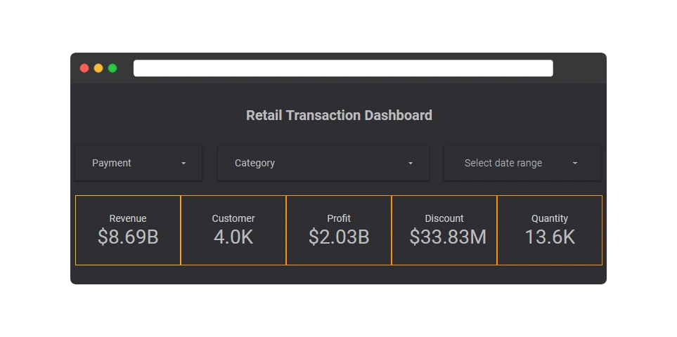

# data-visualization-1
    

 

 

# Project Overview 📄
This project is a comprehensive sales analysis dashboard built with Google Looker Studio to visualize key performance indicators (KPIs) for a fictional e-commerce store. The main goal is to transform raw sales data into actionable insights, helping stakeholders understand business performance and make data-driven decisions.

> [!NOTE]  
> <b>visit the data-visualization-2 repository, [Here](https://github.com/Zevhys/data-visualization-2)</b>

# Key Analyses & Visualizations 📊
- Overall Performance:  
Tracks total revenue, profit, and the number of items sold over time.

- Category Analysis:  
Compares revenue, profit, and quantity sold across different product categories to identify top-performing and underperforming segments.

- Payment Method Trends:  
Visualizes the popularity and revenue contribution of each payment method.

- Profitability Insights:  
Provides a direct comparison between revenue and profit for each category, highlighting the most profitable areas of the business.

# Tech Stack 🛠️

# Requirements ✅
This guide will walk you through the steps to build this dashboard from scratch using the provided dummy data.

### Step 1: Prepare the Data Source assets
First, you need to get the data into a format that Looker Studio can easily connect to. We'll use Google Sheets for this.

<pre>
- Download the <a href="assets/Dataset.csv">Dataset.csv</a> file from this repository.

- Go to <a href="https://sheets.google.com" target="_blank">Google Sheets</a> and create a new blank spreadsheet.

- In the new spreadsheet, go to File > Import.

- Select the Upload tab and choose the .csv file you just downloaded. Leave the import options as default and click Import data.

- Rename the spreadsheet to something descriptive, like "E-commerce Sales Dashboard Data".
</pre>

### Step 2: Connect Looker Studio to Your Data
Now, let's connect our new Google Sheet to a Looker Studio report.

<pre>
- Go to <a href="https://lookerstudio.google.com" target="_blank">Looker Studio</a> and click on Blank Report.

- You will be prompted to add data to the report. In the list of connectors, select Google Sheets.

- Find and select the spreadsheet you just created ("E-commerce Sales Dashboard Data").

- Ensure the correct worksheet is selected and click the Add button in the bottom right corner.
</pre>

### Step 3: Build the Visualizations 
You are now ready to build the dashboard! You have a blank canvas and all the data fields available in the panel on the right.

<pre>
- Use the PDF Preview: Refer to the Report <a href="assets/Report Preview.pdf">Report Preview.pdf</a> file in this repository as your guide. It shows you what charts to build and what metrics/dimensions to use.

- Add Charts: Click on Add a chart from the toolbar and select the appropriate chart type (e.g., Scorecard, Time series chart, Bar chart, Pie chart).

- Configure Charts: For each chart, drag and drop the fields from the right-hand panel into the Dimension and Metric sections. For example, for a "Revenue by Category" bar chart:
 · Dimension: category
 · Metric: revenue (or the relevant price/amount field)

- Style Your Dashboard: Use the Style tab for each chart to change colors, fonts, and labels to match the preview.
</pre>

# Contribution 🤝
Contributions are welcome! If you have suggestions for improvements or want to report an issue, feel free to open a pull request or create an issue. Thank you for helping to make this project better!
